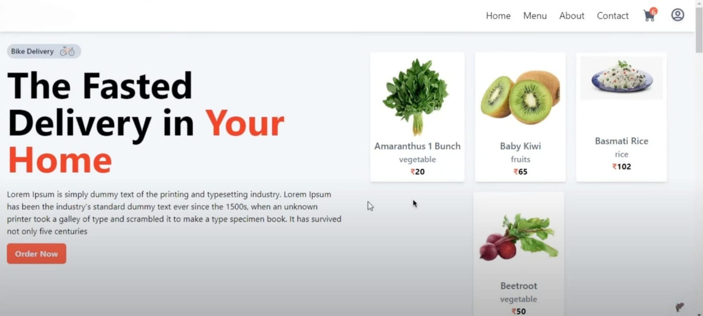

# GroceryMarket

### Welcome to GroceryMarket! This platform connects buyers and sellers, allowing users to purchase groceries directly from sellers and manage their listings efficiently.

## Features

- **Browse Groceries:** Explore a variety of grocery items listed by different sellers.
- **Buy Directly:** Purchase groceries directly from sellers with ease.
- **List Products:** Sellers can list their items, including prices and details.
- **Update Listings:** Modify product details and prices as needed.
- **Remove Listings:** Delete items that are no longer available.
- **Product Details:** View comprehensive information about each grocery item, including images and descriptions.

## Skills Used

###

<div align="left">
  
  
  
  
  
  
  
  
  
  
  
  
  
  
  
</div>

###


## Follow the steps below to set up and install the project dependencies.

### Client

1. Navigate to the client directory:
   ```bash
   cd client
2. Install client dependencies:
   ```bash
   npm install

### Server

1. Navigate to the server directory:
   ```bash
   cd server
2. Install server dependencies:
   ```bash
   npm install
3. In .env write your MongoDB url
   ```bash
   MONGODB_URL=Your_Url

### Running the Project
Follow the steps below to run the project in development mode.

Development Mode

1. Run the project in development mode:
   ```bash
   npm run dev
